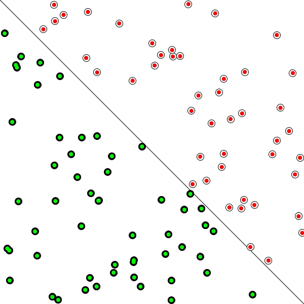

# Neural-Networks

The human brain can be described as a biological neural network—an interconnected web of neurons transmitting elaborate patterns of electrical signals. Dendrites receive input signals and, based on those inputs, fire an output signal via an axon. Or something like that. How the human brain actually works is an elaborate and complex mystery, one that we certainly are not going to attempt to tackle in rigorous detail in this chapter.

The good news is that developing engaging animated systems with code does not require scientific rigor or accuracy, as we’ve learned throughout this book. We can simply be inspired by the idea of brain function.

A neural network is a “connectionist” computational system. The computational systems we write are procedural; a program starts at the first line of code, executes it, and goes on to the next, following instructions in a linear fashion. A true neural network does not follow a linear path. Rather, information is processed collectively, in parallel throughout a network of nodes (the nodes, in this case, being neurons).

Here we have yet another example of a complex system, much like the ones we examined in Chapters 6, 7, and 8. The individual elements of the network, the neurons, are simple. They read an input, process it, and generate an output. A network of many neurons, however, can exhibit incredibly rich and intelligent behaviors.

One of the key elements of a neural network is its ability to learn. A neural network is not just a complex system, but a complex adaptive system, meaning it can change its internal structure based on the information flowing through it. Typically, this is achieved through the adjusting of weights. In the diagram above, each line represents a connection between two neurons and indicates the pathway for the flow of information. Each connection has a weight, a number that controls the signal between the two neurons. If the network generates a “good” output (which we’ll define later), there is no need to adjust the weights. However, if the network generates a “poor” output—an error, so to speak—then the system adapts, altering the weights in order to improve subsequent results.

There are several strategies for learning, and we’ll examine two of them in this chapter.

Supervised Learning —Essentially, a strategy that involves a teacher that is smarter than the network itself. For example, let’s take the facial recognition example. The teacher shows the network a bunch of faces, and the teacher already knows the name associated with each face. The network makes its guesses, then the teacher provides the network with the answers. The network can then compare its answers to the known “correct” ones and make adjustments according to its errors. Our first neural network in the next section will follow this model.

Unsupervised Learning —Required when there isn’t an example data set with known answers. Imagine searching for a hidden pattern in a data set. An application of this is clustering, i.e. dividing a set of elements into groups according to some unknown pattern. We won’t be looking at any examples of unsupervised learning in this chapter, as this strategy is less relevant for our examples.

Reinforcement Learning —A strategy built on observation. Think of a little mouse running through a maze. If it turns left, it gets a piece of cheese; if it turns right, it receives a little shock. (Don’t worry, this is just a pretend mouse.) Presumably, the mouse will learn over time to turn left. Its neural network makes a decision with an outcome (turn left or right) and observes its environment (yum or ouch). If the observation is negative, the network can adjust its weights in order to make a different decision the next time. Reinforcement learning is common in robotics. At time t, the robot performs a task and observes the results. Did it crash into a wall or fall off a table? Or is it unharmed? We’ll look at reinforcement learning in the context of our simulated steering vehicles.

This ability of a neural network to learn, to make adjustments to its structure over time, is what makes it so useful in the field of artificial intelligence. Here are some standard uses of neural networks in software today.

Pattern Recognition —We’ve mentioned this several times already and it’s probably the most common application. Examples are facial recognition, optical character recognition, etc.

Time Series Prediction —Neural networks can be used to make predictions. Will the stock rise or fall tomorrow? Will it rain or be sunny?

Signal Processing —Cochlear implants and hearing aids need to filter out unnecessary noise and amplify the important sounds. Neural networks can be trained to process an audio signal and filter it appropriately.

Control —You may have read about recent research advances in self-driving cars. Neural networks are often used to manage steering decisions of physical vehicles (or simulated ones).

Soft Sensors —A soft sensor refers to the process of analyzing a collection of many measurements. A thermometer can tell you the temperature of the air, but what if you also knew the humidity, barometric pressure, dewpoint, air quality, air density, etc.? Neural networks can be employed to process the input data from many individual sensors and evaluate them as a whole.

Anomaly Detection —Because neural networks are so good at recognizing patterns, they can also be trained to generate an output when something occurs that doesn’t fit the pattern. Think of a neural network monitoring your daily routine over a long period of time. After learning the patterns of your behavior, it could alert you when something is amiss.

This is by no means a comprehensive list of applications of neural networks. But hopefully it gives you an overall sense of the features and possibilities. The thing is, neural networks are complicated and difficult. They involve all sorts of fancy mathematics. While this is all fascinating (and incredibly important to scientific research), a lot of the techniques are not very practical in the world of building interactive, animated Processing sketches. Not to mention that in order to cover all this material, we would need another book—or more likely, a series of books.

So instead, we’ll begin our last hurrah in the nature of code with the simplest of all neural networks, in an effort to understand how the overall concepts are applied in code. Then we’ll look at some Processing sketches that generate visual results inspired by these concepts.

## The Perceptron

Invented in 1957 by Frank Rosenblatt at the Cornell Aeronautical Laboratory, a perceptron is the simplest neural network possible: a computational model of a single neuron. A perceptron consists of one or more inputs, a processor, and a single output.

A perceptron follows the “feed-forward” model, meaning inputs are sent into the neuron, are processed, and result in an output. In the diagram above, this means the network (one neuron) reads from left to right: inputs come in, output goes out.
